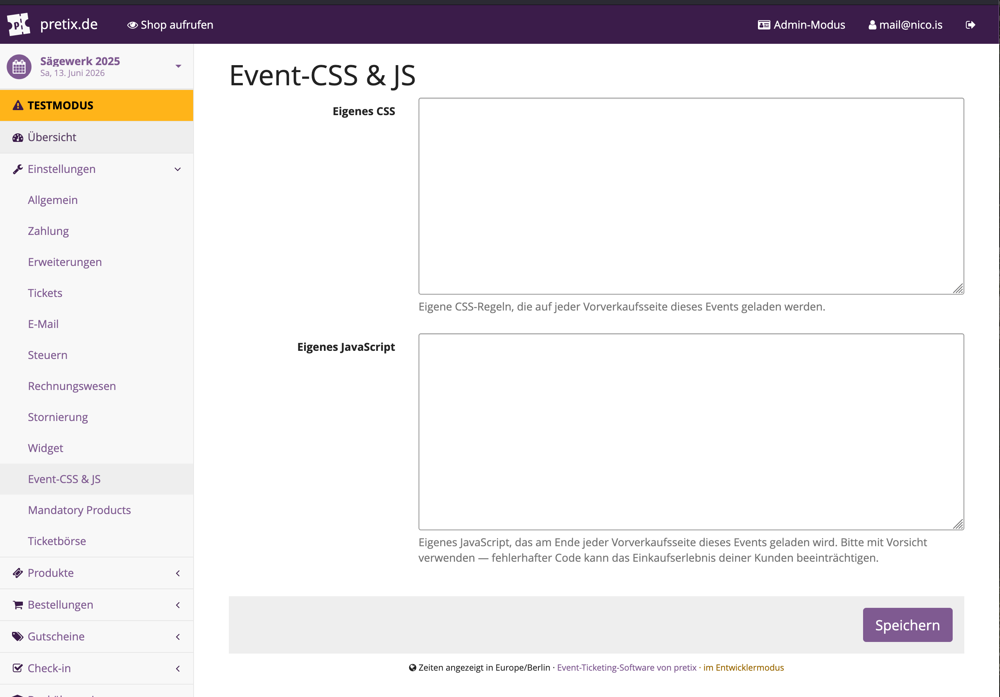

# pretix-event-css-js

Inject custom CSS and JavaScript into the presale pages of individual events in [pretix](https://pretix.eu). Useful for branding tweaks, custom layouts, tracking snippets, or any per-event frontend customization that doesn't warrant a full theme.

**Key capabilities:**
- Per-event custom CSS and JavaScript
- Code editor in the event settings panel
- Content-hash based cache busting (1-year cache with automatic invalidation on change)
- Clean removal of settings when the plugin is uninstalled

## Screenshot

**Settings — custom CSS & JS editor**



## How it works

1. You enter custom CSS and/or JavaScript in the event settings.
2. The plugin injects a `<link>` tag (CSS) into the page head and a `<script>` tag (JS) into the page footer of every presale page for that event.
3. The CSS and JS are served from dedicated endpoints with a content-hash query parameter for cache busting. Browsers cache them for up to 1 year — when you update the code, the hash changes and browsers fetch the new version automatically.

## Installation

```bash
pip install pretix-event-css-js
```

Then restart the server. The plugin registers itself automatically via the `pretix.plugin` entry point — no manual `INSTALLED_APPS` edit needed.

### Development installation

```bash
git clone https://github.com/nicoknoll/pretix-event-css-js.git
cd pretix-event-css-js
pip install -e .
```

## Usage

1. Enable the plugin for your event under **Settings** → **Plugins**.
2. Go to **Settings** → **Event-CSS & JS** in the event control panel.
3. Enter your custom CSS and/or JavaScript and save.

Your code will be loaded on every presale page of that event.

> **Heads up:** Faulty JavaScript can break the checkout flow for your customers. Test thoroughly before going live.

## Dependencies

| Package | Purpose |
|---|---|
| `pretix >= 2.7.0` | Host platform |

Python 3.10+ required. No additional dependencies beyond pretix itself.

## License

MIT — see [LICENSE](LICENSE).